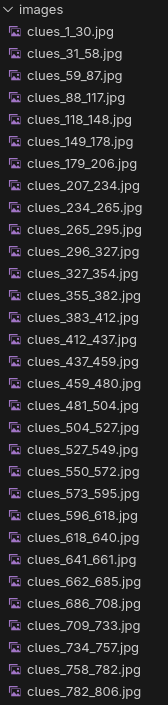

# 221B Baker Street Board Game Clue Web Application

## About
The [221B Baker Street Board Game](https://en.wikipedia.org/wiki/221B_Baker_Street_(board_game)) is a fun board game. However, searching through the clue book is a very tedious process, especially when you have a handful of players waiting for their turn.

I made the web app to address this problem.

## Installation
Download everything in [app/](app/). 

The web app can be hosted on a device, such as a phone. There are many apps available that allow you to host static websites. Choose one. 

The idea is for one phone/device to host the web app, while all other users access the web app from their own devices by connecting onto the same network as the host phone (via hotspotting or in a LAN).

## Setup

### Clue Images
You'll notice that [app/data/images/](app/data/images/) is empty. This is intentional. You'll have to scan each page from the physical clue book and place them in this folder in the following format:



Notice how every file is formatted as:

``` clues_XXX_XXX.jpg ```

where the ``` XXX ``` are the first and last clue of the specific scanned page.

It looks like a lot of files, but it really won't take a long time to scan them all.

In my version of 221B Baker Street, the clue book ranges from ```1``` to ```1050```.

### Configuration
The following directory and file are configurable:
- Inside [app/data/audio/](app/data/audio)
- [app/data/clue_data.json](app/data/clue_data.json)

#### Audio
The [app/data/audio/](app/data/audio) directory contains two audio files by default. You are welcome to change these to alternate audio files.

One audio file is played during the timer countdown while the other is played after the timer ends. This audio file typically only lasts 2 to 4 seconds while the former should last as long as the timer.

#### JSON
The [app/data/clue_data.json](app/data/clue_data.json) contains elements that can be configured by the user:
  ```
  {
    "timerMusicFile": "data/audio/quiz-countdown.mp3",
    "timerMusicStartTime": 59,
    "endTimerMusicFile": "data/audio/bell-ringing.mp3",
    "endTimerMusicStartTime": 0,
    "timerDuration": 30,
    "maxClueNumber": 1050,
    "minClueNumber": 1,
    "imageFilenames": {
        "clues_1_30.jpg",
        "clues_31_58.jpg"
    }
  }
  ```

  Once you have scanned the clue book pages and named the files appropriately, make sure to set the ```imageFilenames``` list. The above is an example containing two clue pages.

  If you change the audio files, make sure to update the file names in the json file.

  In addition, the timer duration, in seconds, can be adjusted via ```timerDuration```.

  The ```timerMusicStartTime``` and ```endTimerMusicStartTime``` set the starting point of the audio files in seconds.

  If you adjust ```timerDuration```, make sure to adjust ```timerMusicStartTime``` so that the audio file ends when the timer ends.

## Usage
Demo of the web app on a phone.
[Video Link](assets/clue_book_demo.webm)

## Credits

[bell-ringing.mp3](app/data/audio/bell-ringing.mp3) Sound Effect by [freesound_community](https://pixabay.com/users/freesound_community-46691455/?utm_source=link-attribution&utm_medium=referral&utm_campaign=music&utm_content=98323) from [Pixabay](https://pixabay.com/sound-effects//?utm_source=link-attribution&utm_medium=referral&utm_campaign=music&utm_content=98323")

[quiz-countdown.mp3](app/data/audio/quiz-countdown.mp3) Music by [Paolo Argento](https://pixabay.com/users/paoloargento-38603296/?utm_source=link-attribution&utm_medium=referral&utm_campaign=music&utm_content=194417) from [Pixabay](https://pixabay.com//?utm_source=link-attribution&utm_medium=referral&utm_campaign=music&utm_content=194417)
